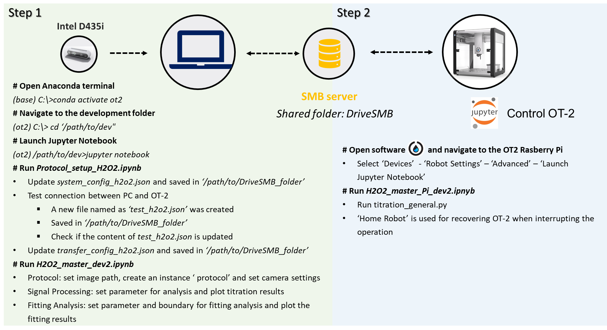

# High-throughput (HTE) robotic colourimetric titrations using computer vision

* An automated HTE robotic titration using a liquid-handling robot Opentrons(OT-2) and a standard webcam enables in-situ, affordable titration analyses. 

* Its modular design allows adaptability for materials chemsitry and integration into automated workflows, enhancing efficiency in chemical search.


## Requirements and Installation

#### Clone the repo into your computer

```
git clone https://github.com/yuanlee0325/HTE-robotic-titration-using-computer-vision.git
```

#### For working PC:

##### Create a virtual environment

```
conda create -n ot2 python>=3.9
conda activate ot2
```

##### Install requirements 
```
pip install -r requirements.txt
```

#### For Opentrons(OT-2): 

##### Install extra packages to OT-2

 [pysmb](https://www.piwheels.org/simple/pysmb/pysmb-1.2.9.1-py3-none-any.whl#sha256=2a20a9d945efc2f6fe86afbe272f6dd4786344aca046b4ca2e98d519db817c20)<br>
 [tqdm](https://www.piwheels.org/simple/tqdm/tqdm-4.66.2-py3-none-any.whl#sha256=f78fd60412e4653a0be68fe9fc5424dc07ed3479bc765a3ab30e782d3d4dbd41)<br>
 [pyasn1](https://www.piwheels.org/simple/pyasn1/pyasn1-0.5.1-py2.py3-none-any.whl#sha256=238ed5b4e0785e285c20dddcfd46ea3585d0ed25bd174d5737a08813db0de176)

use ssh key to get access to OT-2
```
ssh -i ot2_ssh_key root@ROBOT_IP
```
create a directory to store these packages
```
mkdir -p /var/data/user_storage/packages
```
transfer files to the directory 
```
scp -i ot2_ssh_key /local/path/to/package_name.whl/on/computer root@ROBOT_IP:/var/data/user_storage/packages
```
navigate to packages directory
```
cd /path/to/packages
```
install packages to a targeted directory 
```
python3 -m pip install --target=/var/lib/jupyter/notebooks package_name.whl
```

##### Upload files to OT-2<br>
(1) Navigate to notebooks using `http://ROBOT_IP:48888` or open Opentrons Software, click `device`, `Robot Settings`, `Advanced`, `Launch Jupyter notebook` subsequently<br>
(2) Click `upload` to upload the essential files saved in the `folder4ot2`<br>
(3) Update robot/PC ip configurations within the `otsmb_aic.py` located in `/folder4ot2/utils`<br>

## Usage 



## Example 

#### Video
A [video](https://doi.org/10.5281/zenodo.13825237) of this HTE robotic chemical titration has been provided<br>
#### Data
Three different types of chemical titration performed by this workstation were shown in the `Data.zip` folder stored in [Zenodo](https://doi.org/10.5281/zenodo.13929893), including:<br>
(1) Redox Titration: H<sub>2</sub>O<sub>2</sub> determination titrated by KMnO<sub>4</sub><br>
(2) Acid-Base Titration: pH indicator using methylene orange<br>
(3) Complexometric Titration: Ca<sup>2+</sup> titrated by EDTA<br>

## Built With

This project uses the following libraries/frameworks. 
- [NumPy](https://numpy.org)
- [Scipy](https://www.nature.com/articles/s41592-019-0686-2)
- [Pandas](https://pandas.pydata.org)
- [Matplotlib](https://matplotlib.org)
- [Scikit-Learn](https://scikit-learn.org)
- [PyTorch](https://pytorch.org)
- [OpenCV](https://opencv.org)
- [Pysmb](https://pysmb.readthedocs.io/en/latest/)

## Authors
* [Yuan Li](http://www.linkedin.com/in/yuan-li-4aba90278) [](https://orcid.org/0009-0008-4995-4186) (Yuan.Li@liverpool.ac.uk)
* Biplab Dutta (biplab294@gmail.com)

## License
Distributed under the Unlicense License. See `LICENSE.txt` for more information.

